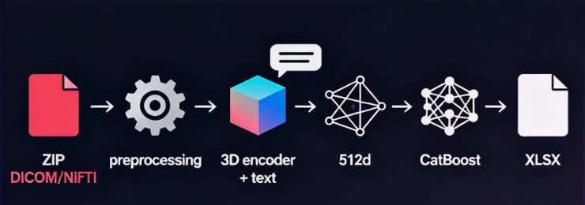
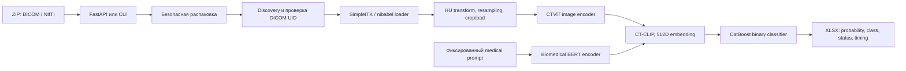

# Chest CT Pathology Screening

[](https://github.com/ilyascw/chest-ct-classification/actions/workflows/ci.yml)
[](https://www.python.org/)
[](https://mypy-lang.org/)

Исследовательский сервис для первичного бинарного скрининга КТ органов
грудной клетки: `норма` / `есть признаки патологии`. Система принимает ZIP с
DICOM-сериями или NIfTI-томами, строит 512-мерные CT-CLIP-эмбеддинги,
классифицирует их с помощью CatBoost и возвращает воспроизводимый XLSX-отчёт.

> Проект не является медицинским изделием и не предназначен для постановки
> диагноза без врача. Это прототип системы поддержки приоритизации исследований.



## Зачем нужен продукт

При пакетной обработке КТ основная операционная проблема — быстро выделить
исследования, которым требуется первоочередное внимание рентгенолога. Сервис
автоматизирует однотипную подготовку данных и формирует единый отчёт с
вероятностью патологии, статусом обработки и диагностикой технических ошибок.

Практическая ценность:

- предварительная сортировка очереди исследований по риску;
- единый интерфейс для DICOM и NIfTI вместо ручных конвертаций;
- пакетная обработка с изоляцией ошибок отдельных серий;
- машиночитаемый XLSX-результат для последующей интеграции.

Граница продукта принципиальна: модель отвечает на бинарный вопрос и не
локализует очаг, не определяет конкретный диагноз и не заменяет заключение
врача.

## Качество модели

Финальный эксперимент сохранён в
[`notebooks/final.ipynb`](notebooks/final.ipynb). Исходная выборка объединяла
1 182 КТ-исследования из CT-RATE и открытых наборов MosMedData. Разбиение
выполнялось до обучения CatBoost в пропорции 70/15/15, стратифицированно по
классу, с `random_state=42`.

После фильтрации и успешного извлечения CT-CLIP-признаков в матрицы оценки
вошли 758/163/161 объектов:

| Split | N | Accuracy | Precision | Recall | F1 | ROC AUC | PR AUC | Specificity |
|---|---:|---:|---:|---:|---:|---:|---:|---:|
| Validation | 163 | 0.8221 | 0.8556 | 0.8280 | 0.8415 | 0.9055 | 0.9368 | 0.8143 |
| Test | 161 | 0.7950 | 0.8021 | 0.8462 | 0.8235 | **0.8642** | **0.8833** | 0.7286 |

Основной результат для сравнения — test ROC AUC 0.8642. Train-метрики намеренно
не используются как показатель качества. Сохранённый эксперимент имеет
ограничение: разбиение стратифицировано по исследованиям, но в ноутбуке нет
подтверждения patient-level grouping. Перед клинической интерпретацией нужны
внешняя валидация, patient-level split, оценка калибровки и анализ по
сканерам/протоколам.

## Архитектура



Основные компоненты:

| Слой | Ответственность |
|---|---|
| `ct_pathology.api` | HTTP upload, lifecycle моделей, лимит размера, коды ошибок |
| `ct_pathology.pipeline` | Оркестрация исследований, параллельная обработка, отчёт |
| `ct_pathology.medical_io` | Поиск серий, DICOM UID validation, загрузка томов |
| `ct_pathology.preprocessing` | HU-преобразование и приведение к `480×480×240` |
| `ct_pathology.feature_extraction` | CT-CLIP/CTViT и фиксированный текстовый prompt |
| `ct_pathology.model` | Обучение, загрузка и inference CatBoost |

CT-CLIP — мультимодальная foundation model, а не генеративная LLM. Текстовая
ветвь использует Biomedical BERT и фиксированный prompt
`chest computed tomography scan for pathology detection`; RAG в проекте не
применяется.

## Инженерный подход

- `src`-layout и единый installable package через `pyproject.toml`;
- CLI entry point `ct-pathology` и FastAPI adapter над одним core pipeline;
- `mypy --strict` для всего first-party пакета и тестов;
- Ruff, `compileall` и unit-тесты в GitHub Actions;
- typed data contracts для studies, volumes, embeddings и результатов;
- ZIP-защита от path traversal, symlink и zip-bomb сценариев;
- потоковая загрузка с настраиваемым лимитом, временные данные удаляются;
- ошибки одного исследования попадают в отчёт и не раскрывают traceback клиенту;
- контейнер с одним GPU-resident Uvicorn worker и health endpoint.

Код CT-CLIP/CTViT в `src/ct_clip` и `src/transformer_maskgit` считается vendored
research code и не включён в first-party strict gate. Происхождение компонентов
описано в [`docs/THIRD_PARTY.md`](docs/THIRD_PARTY.md).

## Быстрый старт

### 1. Окружение

Рекомендуется Python 3.11 и NVIDIA GPU. CPU-режим предусмотрен, но полный
3D-инференс будет существенно медленнее.

```bash
python3.11 -m venv .venv
source .venv/bin/activate
python -m pip install --upgrade pip

# Linux + CUDA 12.8
python -m pip install \
  torch==2.9.0 torchvision==0.24.0 torchaudio==2.9.0 \
  --index-url https://download.pytorch.org/whl/cu128

python -m pip install -e ".[research,dev]"
```

Для другой платформы выберите подходящую сборку PyTorch на
[официальной странице установки](https://pytorch.org/get-started/locally/).

### 2. Модели

Положите в `models/`:

```text
models/
├── CT_LiPro_v2.pt
└── catboost_pathology_classifier.cbm
```

CT-LiPro доступен в
[коллекции CT-RATE](https://huggingface.co/datasets/ibrahimhamamci/CT-RATE/tree/main/models/CT-CLIP-Related).
CatBoost checkpoint создаётся финальным training workflow и намеренно не
хранится в Git. Подробности — в [`models/README.md`](models/README.md).

При первом запуске также требуется доступ к Hugging Face для загрузки
`microsoft/BiomedVLP-CXR-BERT-specialized`; затем используется локальный cache.

### 3. CLI

```bash
ct-pathology studies.zip \
  --ctclip-checkpoint models/CT_LiPro_v2.pt \
  --catboost-model models/catboost_pathology_classifier.cbm \
  --device auto \
  --max-workers 1 \
  --output results.xlsx
```

### 4. API

```bash
export CT_MODELS_DIR=models
export CT_DEVICE=auto
python -m uvicorn ct_pathology.api.main:app \
  --host 0.0.0.0 \
  --port 8000 \
  --workers 1
```

После загрузки моделей доступны:

- `GET /health` — readiness моделей и CUDA;
- `GET /info` — безопасная runtime-конфигурация;
- `POST /predict` — ZIP → XLSX;
- `GET /docs` — OpenAPI/Swagger UI.

```bash
curl --fail-with-body \
  -F "file=@studies.zip" \
  http://localhost:8000/predict \
  --output results.xlsx
```

Переменные окружения:

| Variable | Default | Назначение |
|---|---|---|
| `CT_MODELS_DIR` | `/app/models`, затем `./models` | Каталог checkpoint-файлов |
| `CT_DEVICE` | `auto` | `auto`, `cpu` или `cuda` |
| `CT_MAX_WORKERS` | `1` | Параллелизм обработки исследований |
| `CT_MAX_UPLOAD_MB` | `10240` | Максимальный размер upload |
| `CT_API_TMP_DIR` | `/tmp/ct_api` | Временная директория |
| `CT_LOG_LEVEL` | `INFO` | Уровень логирования |

### 5. Docker

Dockerfile использует CUDA 12.8 и PyTorch `cu128`.

```bash
cp .env.example .env
docker compose build
docker compose up -d
curl --fail http://localhost:8000/health
```

Полная инструкция: [`DOCKER_README.md`](DOCKER_README.md).

## Тестирование и воспроизводимость

Локальный quality gate:

```bash
mypy
ruff check --exclude "*.ipynb" \
  src/ct_pathology tests/test_archive_utils.py tests/test_data_models.py
python -m compileall -q src tests
python -m unittest discover -s tests -p "test_*.py" -v
```

Unit-тесты покрывают валидацию конфигурации и защиту распаковки от traversal,
symlink и ресурсных атак. Полный end-to-end inference не выполняется в CI:
он требует GPU, исходных медицинских томов и двух checkpoint-файлов.

Протокол и сохранённые результаты эксперимента доступны в
`notebooks/final.ipynb`; повторный запуск требует исходных датасетов и
checkpoint-файлов. В дальнейшей production-валидации целесообразно
автоматически сохранять:

- ROC AUC, PR AUC, recall, specificity и calibration error;
- долю технически не обработанных исследований;
- latency по этапам loader/preprocessing/encoder/classifier;
- срезы качества по источнику данных, протоколу и оборудованию.

## Формат результата

Лист `Results` содержит:

| Поле | Описание |
|---|---|
| `path_to_study` | Внутренний путь исследования во временном архиве |
| `study_uid`, `series_uid` | Технические DICOM/NIfTI identifiers |
| `probability_of_pathology` | Вероятность положительного класса `[0, 1]` |
| `pathology` | Бинарный прогноз по порогу 0.5 |
| `processing_status` | `Success` или `Failure` |
| `time_of_processing` | Время обработки исследования |
| `error_details` | Безопасное описание технической ошибки |

Дополнительно создаются листы `Summary` и, при наличии ошибок, `Errors`.

## Структура репозитория

```text
.
├── pyproject.toml                 # package metadata, dependencies, mypy/Ruff
├── src/
│   ├── ct_pathology/
│   │   ├── api/                   # FastAPI adapter
│   │   ├── medical_io/            # DICOM/NIfTI discovery and loading
│   │   ├── pipeline/              # orchestration, contracts, CLI, reports
│   │   ├── feature_extraction.py  # CT-CLIP wrapper
│   │   ├── preprocessing.py       # volume normalization
│   │   └── model.py               # CatBoost wrapper
│   ├── ct_clip/                   # vendored CT-CLIP research code
│   └── transformer_maskgit/       # vendored CTViT/MaskGIT code
├── tests/                         # lightweight unit tests
├── notebooks/                     # research and evaluation trail
├── models/                        # local, Git-ignored checkpoints
├── img/                           # architecture assets
├── Dockerfile
└── docker-compose.yaml
```

## Данные и научная основа

Эксперименты опираются на:

- [CT-RATE](https://huggingface.co/datasets/ibrahimhamamci/CT-RATE);
- [MosMedData: lung cancer CT, тип VIII](https://mosmed.ai/datasets/datasets/mosmeddata-kt-s-priznakami-raka-legkogo-tip-viii/);
- [MosMedData: low-dose lung CT, тип I](https://mosmed.ai/datasets/datasets/mm/);
- [MosMedData: COVID-19 CT, тип I](https://mosmed.ai/datasets/datasets/mosmeddata-kt-s-priznakami-koronavirusnoi-infektsii-covid-19-tip-i/).

Foundation model: Ibrahim Ethem Hamamci, Sezgin Er et al.,
“Developing Generalist Foundation Models from a Multimodal Dataset for 3D
Computed Tomography”, [arXiv:2403.17834](https://arxiv.org/abs/2403.17834).

Датасеты, веса и сторонний код имеют собственные условия использования. Перед
коммерческим применением необходимо отдельно проверить лицензии и требования к
обработке медицинских данных.
